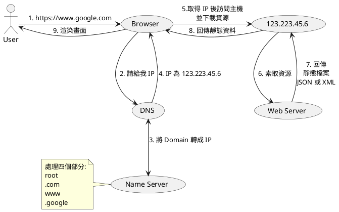
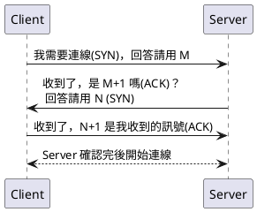

# 前言

最近因為在找新工作，同時也需要把一些知識打穩，既然常在寫 side project，那麼一定要對於 http 請求後發生什麼事、SSL、OAuth、OpenID 都需要理解清楚，否則串了這麼多服務也寫了應用，但在關鍵時沒講出來的話作品就發揮不出它的功用了 😞，那麼以下就會用我的觀點以及紀錄方法來敘述這些功能。

> 註：若有發現有什麼問題或內容有誤的話麻煩再留言讓我知道，或是`寄信`給我也是可以喔！

# 從輸入`https://www.google.com`之後發生了什麼事?

首先須了解`https://www.google.com`這樣的網址是如何組成:

<!-- more -->

1. https: 通訊協定，其他常見如: tcp、udp、websocket、mqtt...
2. www: 常聽到的 sub domain 就指這個部分，也會聽到 host 的名稱，意指在一個 Domain 下若有多個主機時則用這個部分來指定名稱為特定主機，一般預設進入點為 `www`。
3. .google: 這部分學名為 `Second Level Domain`(SLD)，在 Top level domain 搜尋完後接著搜尋的層級，通常為個人品牌、公司行號為名稱。
4. .com: 這層名為 `Top Level Domain`(TLD)，常見為 com、org、gov、edu、io，較好理解的方式我認為就是把當前進入點判斷為何種`組織`，再以此分類下去找 SLD，有點二元搜尋的概念 😁。
5. root: 一開始我看到這部分也覺得霧煞煞，簡單來說每個域名(Domain)的結尾都會有 `.` 這個小數點，它是指域名(Domain)的進入點，所有上的 Domain 都會從這個地方開始判斷。

> 上述是照著網址由左而右寫，實際上則是從右往左判斷

上面步驟已經說明清楚每個部分了，接下來就說明從瀏覽器輸入網址後的步驟吧！

## 向 DNS 要 IP



DNS 全名為 Domain Name Server，主要職責是幫忙把 網域名稱(Domain Name) 轉成 IP，因為網域名稱是人才看得懂而機器只認得 IP，因此需要 DNS 來幫忙轉譯。

### Name Server

藉由上圖最終 DNS 會收到每個單獨的 Name Server 回傳後的值並組成 IP 回傳給瀏覽器。

## 跟 IP 請求資源

待瀏覽器收到 IP 後去請求資源，而 IP (資源方)那一般來說都會有個 Web Server 擋在前面(Nginx、Apache)，若是有前端頁面則是讓瀏覽器下載靜態檔案(static)，而若只是單純導向至 API 的話就直接回傳定義的資料格式(JSON、XML...)。

## 快取

此時瀏覽器下載完後則會存到快取(Cache)裡，加速下次載入。

## 渲染


> 參考[六角學院](https://w3c.hexschool.com/blog/8d691e4f)

這邊就簡單敘述一下前端渲染發生的經過，HTML 會產生出一個 `DOM Tree`，CSS 會有一個 `CSSOM Tree`，在各別產生完後會合併成一個 `render Tree`，最後經由 `layout` 的步驟讓瀏覽器將 Tree 渲染至畫面上，完成畫面顯示的步驟。

- 上述的 DOM 就是寫 jQuery 時呼叫的那個 DOM 元素

以上就是當你輸入一個網址後會遇到的事情經過～

# 輸入網址後，你怎能不知道怎麼連線呢？

## 準備連線 - 三方交握 (Three-Way Handshake)



這邊我用最簡單的表示，`SYN`在三方交握會是一個帶有序列號(n)的請求，而`ACK`則是代表回應對方我們這邊收到的訊號，會帶有 n+1 的數字回傳。

在三方交握中，會先由 Client 告訴 Server 現在它要連線並給一個數字，回傳時會送 n+1 的原因是避免在請求的過程中因各種因素導致回來的值錯誤時的一個防範機制，用 `+1` 這個做法來確保對方給的回傳值是我剛剛送出去的值 +1，避免連線過程中混亂。

簡單的記法就是從 Client 先送一個數字 N 給 Server，而回傳時一定是給 N+1 並且帶著一個 M，Client 收到後確認完則在回傳 M+1 讓 Server 也確定 CLient 收到了，完成三次連線。

### Bonus - 為什麼不兩次或四次交握呢？

經過上述的流程，一定是一個發(SYN)，一個收完後告訴對方它收到(ACK)，那如果是只有`兩次`， Client 會不知道 Server 收到沒，導致這次連線失敗。

然後四次、五次、六次其實都是可以做到的，但只是工程師在實作東西時都會盡可能的精簡它，所以為了不浪費系統資源，因此最低次數就是`三次`！🎉

## 斷開連線 - 四次揮手(Four-Way Wavehand)

> 四次揮手是用 FIN 以及 ACK 當作 請求 以及 回應


> 圖片[參考](<(https://kknews.cc/code/yr9ng6j.html)>)

> Client = 1, Server = 2 的話，順序就是 1 - 2 - 2 - 1

我了解這部分的方法是

#### 每個關閉連線時都需要等待

所以向 Client 送請求(`FIN`)到 Server 會先告訴 Client 已經收到(`ACK`)，處理完後再送一個請求給 Client，Client 最後就在回應 Server 告訴他能關閉來斷開連線。

因為是在第三步驟最後回應時需要等待 Server 的主動發送，因此交握的最低數量就變成`4`了。

基本上跟三方交握流程是一樣的，差別在於到 Server 時不會馬上告訴 Client 等等要回應的值(N)是多少，而是等 ACK 完後過一陣子才回傳 publish FIN flag。

詳細可以參考[這篇](https://kknews.cc/code/yr9ng6j.html)

# SSL

經過了上面無情摧殘後，接下來就是要認識 SSL 這個安全機制了。


除非你的網站內容是全靜態輸出，完全沒串任何 API，否則沒有 SSL 安全性實在是嚴重不足啊！因為沒有 SSL 的網站會享有[中間人攻擊](https://zh.wikipedia.org/wiki/%E4%B8%AD%E9%97%B4%E4%BA%BA%E6%94%BB%E5%87%BB)的優惠，那既然那麼重要接著就來介紹吧！

> 這裡會簡單敘述一下流程以及功能，但詳細的還是要參考其他部落格詳細的文章喔！

## SSL 有的裝備

SSL 申請時一般都會給三種東西，公鑰(Public key)、私鑰(Private key)、CA(Certificate authority)

1. 公鑰是 Server 發給信任裝置使用的鑰匙
2. 私鑰則是解開來自信任裝置加密封包的鑰匙
3. CA 是 Server 的證書，用來確認 Server 的合法性，若只拿私鑰來解也會含有中間人攻擊的問題

## 流程


> 圖片參考[阮一峰的部落格](http://www.ruanyifeng.com/blog/2014/09/illustration-ssl.html)

Visitor 就等於前面文章提到的 Client，而 CloudFlare 則等於 Server 端。

1. Client 把一個`隨機數`並發送給 Server
2. Server 在產生一組`隨機數+公鑰`給 Client
3. Client 利用收到的`隨機數+公鑰`加密資料回傳給 Server
4. Server 用`私鑰`來解開資料
5. 拿著上圖灰色虛線的東西來產生 Session Key 確認對方

> 隨機數用意為讓密鑰每次產生都不一樣

## SSL 小結

這邊沒有提太多實作跟詳細內容，但看著上述的流程來說有沒有覺得其實跟`三方交握`很像，差別在於 Server 端回傳時有多給 Client 一個公鑰(Public Key)，所以再記這部分時，利用三方交握來理解這件事情，基本上就如魚得水了！😊

# OAuth

接著就一起陪我釐清 OAuth 吧！

## 說明

讓客戶端能以 OAuth 開放標準在第三方應用程式上透過授權(Authorization)的方式取得在服務提供商(LINE、Facebook、Google...)的資料(檔案、照片、影片...)。

## 擁有四種角色

- Resource Owner(簡稱 RO)：可以授權於`終端用戶`存取受保護之資料。
- Resource Server(簡稱 RS)：存取受保護資料的地方，根據 Access Token 之權限處理請求。
- Client：代表使用者去存取受保護資料的應用程式。Client 指任何在 Server 端、桌面或設備上執行的應用程式。
- Authorization Server(簡稱 AS)：職責為認證過使用者的身份，且經由使用者許可後，就會簽發 Access Token 的地方。

## 流程

以下為一個 OAuth 的流程:

```
+--------+                               +---------------+
|        |--(1)- Authorization Request ->|   Resource    |
|        |                               |     Owner     |
|        |<-(2)-- Authorization Grant ---|               |
|        |                               +---------------+
|        |
|        |                               +---------------+
|        |--(3)-- Authorization Grant -->| Authorization |
| Client |                               |     Server    |
|        |<-(4)----- Access Token -------|               |
|        |                               +---------------+
|        |
|        |                               +---------------+
|        |--(5)----- Access Token ------>|    Resource   |
|        |                               |     Server    |
|        |<-(6)--- Protected Resource ---|               |
+--------+                               +---------------+
```

## 小故事

以下會分別用四個角色代替他們：
Client = A 員工、RO = 大樓警衛、AS = 公司櫃檯、RS = 倉庫

並用小故事說明，情境是員工假日需返回公司倉庫拿取零件，但是卻沒帶公司的證件，而公司是在商業辦公室中，大樓警衛認不得這麼多間公司的人，因此需要按照基本流程才能進公司拿取資料，A 員工抵達商辦大樓後：

1. A 員工拿證件出來並填寫基本資料的單子給警衛 (發送請求)
2. 警衛確認完後拿了一個暫時性的鑰匙(`code`)給 A 員工
3. A 員工拿著暫時性鑰匙(`code`)跟公司櫃檯
4. 櫃檯將臨時鑰匙(`code`)換成公司的門禁卡(Access Token)
5. A 員工去倉庫使用門禁卡(Access Token)開倉庫門
6. 倉庫門打開後 A 員工從裡面拿取自己需要的零件(Protected Resource)

> 透過這樣的解釋應該比較好懂吧 ❓

## 小結

看著流程圖，有沒有覺得它還是很像三方交握嗎？只是 Server 端功能切開變成微服務的樣子，並透過三個步驟來獲取 Server 的資源，如此一來會不會覺得這樣親切點呢？

希望能藉由文章的敘述讓你能更快速點了解這些玩意兒。

# OpenID Connect

大家寫了這麼多 side project，對 OAuth 的見聞與使用一定不在其數，但實際上在做像是 LINE Login、Facebook、Google 這類型的 Single Sign On(SSO) 的服務時很常誤以為 `SSO == OAuth`，答案是錯的，SSO 這件事情本身是由 OpenID 來實現，對於實際的原由呢，這邊有[很詳細的介紹](https://medium.com/@petertc/openid-connect-a27e0a3cc2ae)，這邊就不贅述。

主要的核心我覺得要記得這件事：

```
OpenID Connect 是認證（Authentication），OAuth 2.0 則是授權（Authorization）
```

一般來說只要搞懂這兩個字的意思，並透過實作經驗加上記得文件內容，就會對於 OpenID 以及 OAuth 個別的職責是什麼很清楚。


> 這邊一樣參考 petertc 的[文章](https://medium.com/@petertc/openid-connect-a27e0a3cc2ae)

上圖流程可能太複雜，這裡簡單敘述一下，就是他流程基本上與 OAuth 差不多，因為 OpenID 就是在 OAuth 上加一層`使用者認證層(User Identify Layer)`，若記得上述 OAuth 的話，OpenID 會在取得 Access Token 的同時取得一個 ID Token，以下說明一下 ID Token：

ID Token 一般比較常見是 Json Web Token(JWT) 的格式，使用者的資訊一般都會放在這邊，只要拿到了這個就可以跟資料庫去 mapping 就能做使用者管理囉 ❗️

## 小結

OpenID 其中一部分解決了 OAuth scope 這參數定義的問題，在 OpenID 還沒出來之前這個時基本上是服務提供商說的算，眾說紛紜的話那就損失了公信力，因此 OpenID 的 scope 除了要必須輸入 `openid` 以外呢，他還有規定可以輸入`email`、`phone`、`profile`，因此在有規範後在串接第三方服務後就不會各說各的啦！

此外這邊需要再重複一次，OpenID 是`驗證`與各戶端的交握過程後並給初使用者資料，而 OAuth 則是`授權`於應用程式可以取用服務中的某個資料(從倉庫拿貨)，如此一來就能較有效的記得 OpenID 與 OAuth 的差異囉！

# 結論

在這些熱門面試題中往往是準備不完的 😅，但如何有效的記得這些東西的步驟卻是很重要，畢竟不可能只把 HTTP、SSL、OpenID、OAuth 讀完面試就過了吧？還有演算法、資料庫 這些哩哩摳摳的需要釐清，當然這邊是整理出我自己的紀錄方法，希望能透過我的方法讓你能夠更快速的釐清這些功能，但看完了各個文章後還是記得要看官方文件，把真正的東西學進去才是對自己有益的喔！

那本篇就先記錄到這，希望大家能有收穫 😁
