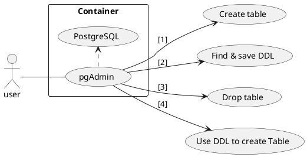

# 前言

當接觸到 PostgreSQL 後 pgAdmin 應該是最常被找到的一個免費 GUI 工具，雖然因為是網站的緣故，很多體驗與桌面版稍嫌落差(跟 postwomen 之餘 postman 一樣)，但今天會告訴大家一個滿好用的功能 - `DDL`，而 DDL 在其他工具上(如 Navicat)上就讓我找不到地方使用，接著就帶大家認識一下 `DDL` 並透過 `pgAdmin` 講解使用的過程 🙂

<!-- more -->

# 流程

接下來文章會按照下圖的步驟去說明：



# What is DDL?

簡單來說 `資料定義語言`（Data Definition Language，DDL）是屬於 DBMS 語言的一種，用於定義 DB schema，且 DBMS 內基本上都有 DDL 編譯器 (complier) 能夠處理 DDL，而它是由 CREATE、ALTER 與 DROP 三個語法所組成。

> 參考來自 [wiki](https://zh.wikipedia.org/wiki/%E8%B3%87%E6%96%99%E5%AE%9A%E7%BE%A9%E8%AA%9E%E8%A8%80)

# 操作環境

以下是我操作的環境，使用 docker-compose 幫我架起 `postgreSQL` & `pgAdmin`。

- MacOS
- Docker
  - pgAdmin
  - PostgreSQL
  - [參考範例](https://github.com/louis70109/postgresql-pgAdmin)

# 步驟介紹

## 1. 建立範例 Table

首先先到 pgAdmin 中，建立一個新的 Table


建立一個範例的 Item table


再來是 Book table


簡單加個 Item 的外鍵 (Foreign Key)


## 2. 找出 DDL

接著就要開始找 DDL 啦！透過 `CREATE SCRIPT` 來找我們要的 DDL 腳本


儲存 `Item` & `Book` 的內容 (存成`.sql` 或是任一文字檔案)


### 注意事項

在前面的範例中 id 使用 流水號(`serial`)，它存在於 `Sequences` 的地方，所以千萬要記得將它一併帶出後儲存起來：


否則會遇到以下問題:

```
ERROR:  relation "Book_id_seq" does not exist
SQL state: 42P01
```

---

## 3. 將範例 Item & Book 刪除

接著就把它刪除來做測試吧！


## 4. 使用 DDL 將 Table 放回去

在 `Public` 這個下拉式選單中`右鍵`就會看到 `CREATE SCRIPT` 的選項


把剛剛的 DDL 複製過來，記得要先讓 Sequence 先進去接著才是 Table

抑或是可以將兩個組裝在一起，先把 Sequence 放在前面，其中一個範例如下:

```
-- SEQUENCE: public.Item_id_seq

CREATE SEQUENCE public."Item_id_seq"
    INCREMENT 1
    START 1
    MINVALUE 1
    MAXVALUE 2147483647
    CACHE 1;

ALTER SEQUENCE public."Item_id_seq"
    OWNER TO postgres;


-- Table: public.Item

CREATE TABLE public."Item"
(
    id integer NOT NULL DEFAULT nextval('"Item_id_seq1"'::regclass),
    title character varying(100) COLLATE pg_catalog."default",
    description text COLLATE pg_catalog."default",
    CONSTRAINT "Item_pkey" PRIMARY KEY (id)
)
WITH (
    OIDS = FALSE
)
TABLESPACE pg_default;

ALTER TABLE public."Item"
    OWNER to postgres;
```

將 `Sequence` 以及 `Table` 的 DDL 組在一起建立就能省掉一個步驟，之後的 Table 使用情境也會雷同，若照著步驟做有出現錯誤時，請記得檢查使用否`順序`有問題。

# 結論

在建置初期也許只有一個 staging，但隨著專案規模變大之後就會分 production、develop、beta、QA 等等的環境，而在建置環境時使用 DDL 這樣的功能也能避免部署人員失誤出錯，例如將欄位長度輸入錯(長度 100 -> 199)，當然如果連複製都能錯那就...😅，總之在專案中放入一個 schema 的資料夾放入這些 DDL 在部署到其他環境時能夠更快速處理這部分。
