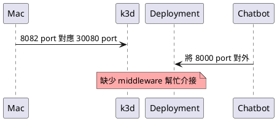
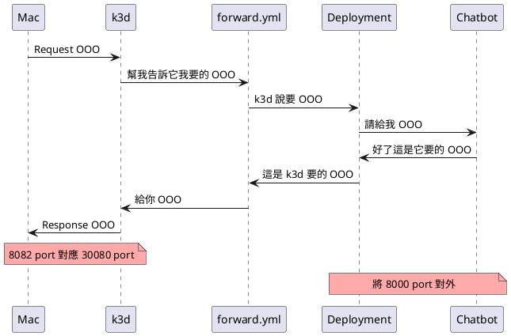

<style>
  section.compact {
    font-size: 150%  
  }
  img[alt~="center"] {
    display: block;
    margin: 0 auto;
  }
</style>

# 前言

Kubernetes 幫忙處理掉許多以前很繁雜的問題(Auto-Scaling、容器管理..)，讓開發者只要手持 Container 與大量 yaml 檔即可將工具部署上去(前提是容器要正常工作)，但作為僅有一台筆電的開發者(我)想試玩總不能直接至雲端開叢集(金幣攻擊)，因此找到了一個解決方案，使用 k3d 來幫助我們建立 Kubernetes 試玩，以下就一步步帶大家從容器建立到將服務部署於叢集上。

範例專案：[louis70109/kubernetes-line-echo-bot](https://github.com/louis70109/kubernetes-line-echo-bot)

<!-- more -->

# 建立容器

首先要先進入 [echo-bot-python](https://github.com/louis70109/kubernetes-line-echo-bot/tree/master/echo-bot-python) 資料夾中，在建立前可以先測試這個範例是否正常運作，這隻機器人只是一隻基本回話的 Chatbot：

```bash
cd echo-bot-python/
pip install -r requirements.txt
cp .env.example .env # 加入 LINE_CHANNEL_SECRET, LINE_CHANNEL_ACCESS_TOKEN 兩把鑰匙
python api.py
```

> - 請至 [LINE Developer Console](https://developers.line.biz/console/) 建立 Chatbot
> - LINE Chatbot 建立流程參考於 [Chatbot Taichung 工作坊的文章](https://nijialin.com/2020/08/27/chatbot-taichung-08/#Massaging-API)

為求方便與練習，這邊使用 Docker Hub 作為 Kubernetes 的容器使用平台，接著請先至 [Docker Hub](https://hub.docker.com/) 註冊帳號並下載 [Docker](https://docs.docker.com/get-docker/)。

```bash
docker login # 登入
docker build . -t="帳號/line-echo-bot-python"  # 將中文改成你 Docker Hub 的帳號
docker push  # 推上 Docker Hub
```

第二段意思是在**當前位置**建立一個 `帳號/line-echo-bot-python` 的標籤，因為在上半部測試 Chatbot 時已經在 **echo-bot-python/** 資料夾下，若不知道位置可使用 `pwd` 來查當前位置。

若建立上還是有問題，可以使用我已經有建立好了的 [Echo-Bot-Container](https://hub.docker.com/repository/docker/louis70109/line-echo-bot-python)。

> 補充: Docker 是 Container 的一個解決方案，Container 不等於 Docker

<iframe width="560" height="315" src="https://www.youtube.com/embed/nc3mBN3LzvM" frameborder="0" allow="accelerometer; autoplay; clipboard-write; encrypted-media; gyroscope; picture-in-picture" allowfullscreen></iframe>

# 練習開始

日常工作中，上半部的工作可能會更加複雜，而若只是練習許多人會直接使用 [Nginx](https://hub.docker.com/_/nginx) 來測試也是沒問題的，那麼接下來就開始使用 [k3d](https://k3d.io/) 來練習囉！

k3d 是什麼呢？它是將 [k3s](https://github.com/k3s-io/k3s) 這個輕量化(Lightweight) Kubernetes 打包成 Docker Image，讓不同平台的 Docker 用戶可以在 Docker 上操作 Kubernetes，當然也有很多不同的服務可以支援，這邊就不贅述。

## 1. 安裝 k3d ([其他安裝方式](https://k3d.io/#installation)) 與 kubectl ([其他](https://kubernetes.io/docs/tasks/tools/install-kubectl/)) 於 Mac


```
brew install k3d
brew install kubectl

kubectl version --client
```

> kubectl 是 kubernetes 操作叢集(cluster)的的指令集

## 2. 建立叢集(cluster)，將 **mycluster** 改成你想要的名字

```
k3d cluster create mycluster --agents 1 -p '8082:30080@agent[0]'
```

-p 的意思是將本機(Mac)的 8082 port 轉到 Docker 裡的 Kubernetes 環境中的 30080 port

#### [2021/10/15 更新]

在這天我在回顧使用時遇到了以下錯誤

```
Error from server (InternalError): an error on the server ("") has prevented the request from succeeding
```

問題是在 `kubectl` 沒有跟 `k3d` 建立的 cluster 連結

因此重新建立一個 cluster 之後會看到以下的 logs:

```
INFO[0000] Prep: Network
INFO[0000] Network with name 'k3d-nijiacluster' already exists with ID 'cd6c156a979c5cdec361aa1322a8b0486a1e910589041c5fdbee361f14693152'
INFO[0000] Created volume 'k3d-nijiacluster-images'
INFO[0001] Creating node 'k3d-nijiacluster-server-0'
INFO[0001] Creating node 'k3d-nijiacluster-agent-0'
INFO[0001] Creating LoadBalancer 'k3d-nijiacluster-serverlb'
INFO[0001] Starting cluster 'nijiacluster'
INFO[0001] Starting Node 'k3d-nijiacluster-server-0'
INFO[0010] Starting Node 'k3d-nijiacluster-agent-0'
INFO[0011] Starting Node 'k3d-nijiacluster-serverlb'
INFO[0012] (Optional) Trying to get IP of the docker host and inject it into the cluster as 'host.k3d.internal' for easy access
WARN[0017] Failed to patch CoreDNS ConfigMap to include entry '192.168.65.2 host.k3d.internal': Exec process in node 'k3d-nijiacluster-server-0' failed with exit code '1'
INFO[0017] Successfully added host record to /etc/hosts in 3/3 nodes
INFO[0017] Cluster 'nijiacluster' created successfully!
INFO[0017] --kubeconfig-update-default=false --> sets --kubeconfig-switch-context=false
INFO[0017] You can now use it like this:
kubectl config use-context k3d-nijiacluster
kubectl cluster-info
```

其中 `kubectl config use-context k3d-nijiacluster` 非常中藥，它需要設定 config 讓 kubectl 認識你的 k3d container，下完這指令之後就不會出現剛剛以上的問題喔。

#### [2021/02/24 更新]

透過 `docker ps` 會看到剛剛建立的 agent 被起了一個 Docker Container，並 forward `8082:30080` port，這就是 k3d 將 k3s 包裝起來的 Container

```
CONTAINER ID   IMAGE                      COMMAND                  CREATED      STATUS      PORTS                             NAMES
cd60952ed93a   rancher/k3d-proxy:v4.0.0   "/bin/sh -c nginx-pr…"   4 days ago   Up 4 days   80/tcp, 0.0.0.0:52713->6443/tcp   k3d-nijiacluster-serverlb
120e93a4ca0a   rancher/k3s:latest         "/bin/k3s agent"         4 days ago   Up 4 days   0.0.0.0:8082->30080/tcp           k3d-nijiacluster-agent-0
dc82667faec0   rancher/k3s:latest         "/bin/k3s server --t…"   4 days ago   Up 4 days                                     k3d-nijiacluster-server-0
```

建立完後使用 `k3d node list` 來看自己剛剛建立的 cluster 們狀態:

```
k3d node list

NAME                        ROLE           CLUSTER        STATUS
k3d-nijiacluster-agent-0    agent          nijiacluster   running
k3d-nijiacluster-server-0   server         nijiacluster   running
k3d-nijiacluster-serverlb   loadbalancer   nijiacluster   running
```

> 按造過往經驗， Mac 在這裡會是代表像是 Linux 中的 iptable(防火牆)，也就是最後一到對外關卡，因此才需要挖通道讓 Mac 與 Docker 中的 kubernetes 互通。

## 3. 將 chatbot(bot_service.yml) 部署到 cluster 中

修改以 clone 下來的[專案](https://github.com/louis70109/kubernetes-line-echo-bot/blob/master/bot_service.yml)，開啟 **bot_service.yml** 後先把上述建立好並推上 DockerHub 的容器貼在 **image** 欄位，並將剛剛建立的 LINE Chatbot key **env 參數**中:

- 容器對外是 8000 port
- 每個像這樣會被部署的服務皆會稱為 Deployment

```yaml
containers:
  - name: bot-service
    image: 帳號/line-echo-bot-python:latest
    ports:
      - containerPort: 8000
    env:
      - name: LINE_CHANNEL_SECRET
        value: '剛剛設定的 SECRET'
      - name: LINE_CHANNEL_ACCESS_TOKEN
        value: '剛剛設定的 TOKEN'
```

將 bot_service.yml 部署上 kubernetes(k3d) 並用 get 看來看 pods 的狀態：

```bash
kubectl apply -f bot_service.yml
kubectl get -f bot_service.yml
```

```
NAME             READY   UP-TO-DATE   AVAILABLE   AGE
bot-deployment   0/1     1            0           12s
```

如果要看更詳細資訊的話可以使用 describe 來看：

```bash
kubectl describe pods # 看細節
```


## 4. 進入 [forward.yml](https://github.com/louis70109/kubernetes-line-echo-bot) 介接 kubernetes(k3d) 與 Deployment(chatbot) 的 port

做到這邊狀態現在整體狀態應該會如下：



看到檔案 - [forward.yml](https://github.com/louis70109/kubernetes-line-echo-bot) 中的以下欄位：

```yaml
ports:
  - name: 'bot-svc'
    nodePort: 30080
    port: 8000
    protocol: TCP
    targetPort: 8000
```

- [文件上](https://k3d.io/usage/guides/exposing_services/#2-via-nodeport)有提到 Kubernetes 預設的 NodePort 範圍為**30000-32767**，因此上述則被設定在 **30080**(範圍中)
  [Reference](https://k3d.io/usage/guides/exposing_services/)
- port 與 targetPort 則是 Deployment(chatbot) 的對外 port

知道動作後，接著就把它放上 kubernetes 吧！

```bash
kebectl apply -f forward.yml
kubectl get -f forward.yml
```

如此一來就用 forward.yml 這個 deployment 介接完成還可以看到是否有對應成功啦！

```
NAME          TYPE       CLUSTER-IP     EXTERNAL-IP   PORT(S)          AGE
bot-service   NodePort   10.xx.ooo.70   <none>        8000:30080/TCP   4s
```



## 5. 測試

我有做一個 root 路由是來測試用的，直接在瀏覽器上輸入 `localhost:8082/` 看有沒有出現 World 的字串，若有出現代表待會測試 chatbot 理論上也是會成功的。

## 6. 測試 Chatbot 有沒有 Echo


由於我是在 Mac 上執行，為求方便我使用 ngrok 來建立暫時含有 SSL 的網址，並把網址複製到剛剛於 [LINE Developer Console](https://developers.line.biz/console/) 建立的 Chatbot 當中的 endpoint 欄位，接著就到剛剛的 Chatbot 上開始跟它聊天吧！


# 結論

憑藉著過往僅存的經驗好不容易完成了一整個 Kubernetes 試玩的循環，雖然曾經因為不小心忘了叢集而被被索取大量費用(怕.png)，但在這次的經驗中了解到文件完整性的重要性([Kubernetes](https://kubernetes.io/docs/home/) & [k3d](https://k3d.io/))，讓開發者可以在碰壁的情況下快速找到需要的解答，也體現出 Kubernetes 生態的完整性！接下來若有其他的練習(踩坑)經驗我也會再透過文章分享給大家！😊
