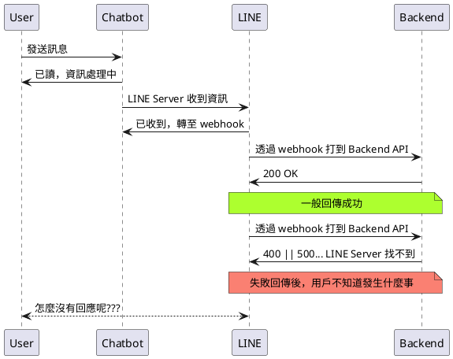

# 前言

大家好，我是 LINE Taiwan 的 Technology Evangelist - Nijia Lin。這次很開心受到 chatbot 社群的邀請，參加了 "[Chatbot meetup 聊天機器人小小聚 31 @ Gather Town](https://events.chatbot.tw/events/30)" 的聚會活動，並且分享 LINE API 更新心得。在此也跟各位分享本次參與的紀錄，並且也希望透過社群分享的力量能夠讓聊天機器人的開發動能更加的盛大。

- 本次活動網頁: [活動網址](https://events.chatbot.tw/events/30)

<!-- more -->

- 活動影片

<iframe width="560" height="315" src="https://www.youtube.com/embed/I6AWuSM5ln8" title="YouTube video player" frameborder="0" allow="accelerometer; autoplay; clipboard-write; encrypted-media; gyroscope; picture-in-picture" allowfullscreen></iframe>

# 介紹

## 📊 Rich menu 更新

> [官方 API 更新新聞](https://developers.line.biz/en/news/2022/05/13/richmenu-keyboard/)

Rich Menu 在與官方帳號互動時很方便，不過過去在使用上會遇到一些小問題，在如今已經有方法解決囉！讓我們繼續往下看。

### 過去遇到 或 無法處理的問題

- 從 Rich Menu 按下按鈕後送出 Flex Message 後，如果訊息量太長，上面的內容會看不到
- 只能手動縮小 Rich Menu
- 切換鍵盤步驟過多
  - 高互動的官方帳號不好處理(例如: 遊戲型 OA)

### 現在能怎麼做?

<script async class="speakerdeck-embed" data-slide="7" data-id="dc6a980bb1844e8192fe3f27d1436748" data-ratio="1.77777777777778" src="//speakerdeck.com/assets/embed.js"></script>

在這次更新中支援了以下四種功能:

- closeRichMenu: 關閉 rich menu
- openRichMenu: 打開 rich menu
- openKeyboard: 打開鍵盤
- openVoice: 打開 voice message 的輸入模式

除了透過 [postback action](https://developers.line.biz/en/reference/messaging-api/#postback-action) 打開以上四種 actions，另外還可以在打開鍵盤同時，輸入文字，並且可以帶有 `\n`，最多 300 字

範例:

```json
{
  "type": "postback",
  "label": "Buy",
  "data": "action=buy&itemid=123",
  "displayText": "Buy",
  "inputOption": "openKeyboard",
  "fillInText": "---\nName: \nPhone: \nBirthday: \n---"
}
```

如此一來解決了透過 Rich Menu 發送 Flex Message 版面看不清楚、切換鍵盤、自動輸入文字等等的問題，讓大家在開發 Chatbot 時可以有更好的使用者體驗！

> API Expert - 均民 詳細寫了一篇文章，歡迎大家參考: [新功能：在官方帳號開關選單、切換文字或語音輸入](https://taichunmin.idv.tw/blog/2022-05-14-line-postback-input-option.html)

## 🌏LIFF 更新

最近 LIFF 團隊釋出了讓大家可以快速建立 web app 的工具，支援了各大主流框架，且使用方式相當容易。並且也提供了去年 DevDay 提到的兩個 plugin，以下就帶大家看一下！

> 參考[最近的新聞](https://developers.line.biz/en/docs/liff/cli-tool-create-liff-app/#advance-preparation)

### 透過 npx 初始化一個 LIFF app

```
$ npx @line/create-liff-app
```

<iframe width="560" height="315" src="https://www.youtube.com/embed/wrcJTeD77ZE" title="YouTube video player" frameborder="0" allow="accelerometer; autoplay; clipboard-write; encrypted-media; gyroscope; picture-in-picture" allowfullscreen></iframe>

### 選擇想用的框架與相關參數


- 名稱
- 框架
- 型別
  - JavaScript/TypeScript
- LIFF ID
  - 會在 `.env` 中，還沒填後續可以改
- 套件管理？ yarn || npm

### [LIFF Inspector/Mock](https://developers.line.biz/en/news/2022/04/25/liff-plugin/)

<script async class="speakerdeck-embed" data-slide="4" data-id="dc6a980bb1844e8192fe3f27d1436748" data-ratio="1.77777777777778" src="//speakerdeck.com/assets/embed.js"></script>

各位開發者不管在開發何種網頁上的內容，最需要的就是透過 DevTools 去檢查是否有元素跑掉，或是相關邏輯印出來的資訊是否有符合預期。過去在開發 LIFF 時會遇到的問題就是，在手機端測試開發項目時，除了用 alert() 暴力破解之外，就是 vConsole 來協助開發時顯示一些 log 方便除錯。

而在如今 LIFF 團隊出了全新的 plugin - Inspector，協助大家在手機/桌機開發 LIFF app 時，可以讓相關的訊息透過 websocket 的方式到 PC 瀏覽器的 DevTools 中顯示，如此一來就可以在開發上有更好的體驗。

<script async class="speakerdeck-embed" data-slide="5" data-id="dc6a980bb1844e8192fe3f27d1436748" data-ratio="1.77777777777778" src="//speakerdeck.com/assets/embed.js"></script>

另一方面的 plugin，Mock 是許多開發 LIFF 的前端開發者很大的福音，畢竟 LIFF 有一部份還是依靠 LINE Server 上的交握才可以讓大家獲取一些應用程式中的行為，在這邊透過 Mock 就可以測試流程中把 LIFF 給擋住，預設他的行為會是正確的，進而達到測試的目的性。

## 🚀 [Flex Message Update 3](https://developers.line.biz/en/news/2022/03/11/flex-message-update-3-released/)

<script async class="speakerdeck-embed" data-slide="9" data-id="dc6a980bb1844e8192fe3f27d1436748" data-ratio="1.77777777777778" src="//speakerdeck.com/assets/embed.js"></script>

- video 可展示在 hero 區塊 🚀
- 在 box component 中指定寬、高最大值
- text component 可加上行距(line spacing)
- [Flex Message Simulator](https://developers.line.biz/flex-simulator/) 支援 Update 3

影片功能是我在早期開發 Flex Message 時就很期待的功能之一，如今終於可以使用啦！並且搭配在上一版中已可以放上 APNG 來展示動圖，如此一來整個 Flex 就可以更加的完整使用，搭配更多的英用來操作。

> 文章可以參考： [如何透過 LINE Video Flex Message 來打造影片翻譯（自動輸出文字）LINE Bot 聊天機器人](https://engineering.linecorp.com/zh-hant/blog/line-video-flex-message-bot/)

## 📝 [Webhook redelivery](https://developers.line.biz/en/news/2022/03/07/pre-release-webhook-redelivery/)

<script async class="speakerdeck-embed" data-slide="13" data-id="dc6a980bb1844e8192fe3f27d1436748" data-ratio="1.77777777777778" src="//speakerdeck.com/assets/embed.js"></script>

過去可能在某次上版之後，開發者自己寫的 Chatbot(Backend API) 忽然壞掉，導致 chatbot 在收到訊息轉打到 webhook 時完全沒反應，更前端的用戶卻不知道發生什麼事，即便再後來修好了，當時用戶的需求沒辦法被滿足，這樣子的體驗就會變得不太好。(如下)



在這次有了 Webhook redelivery 之後，可以在 LINE Developer Console 中去設定按鈕。

設定完了之後，在請求失敗後 LINE Server 也會在一定的時間內持續打訊息到 webhook url 中，讓暫時故障的 Server 可以在修復後收到請求，讓用戶後續還可以收到回饋，避免用戶流失的問題。

### Check error statistics for sending webhooks

<script async class="speakerdeck-embed" data-slide="16" data-id="dc6a980bb1844e8192fe3f27d1436748" data-ratio="1.77777777777778" src="//speakerdeck.com/assets/embed.js"></script>

一般來說會開啟 redelivery，就是預計會有失敗的呼叫產生，因此在這也會一起把這些歷程也給記錄下來，因此這邊打開之後可以看到被呼叫的錯誤狀態，進而搭配 Server log 去追朔到狀態發生當下的問題，協助大家可以更釐清是否有邏輯上的問題產生。

# 結論

希望透過這次難得的機會在線上跟大家分享這陣子 LINE API 的相關更新，如果覺得這邊文章有幫助，歡迎分享給妳身旁的開發者朋友們喔！一起開發出更多不一樣的應用。那我們就下一篇文章再見啦～～

# 活動小結

立即加入「LINE 開發者官方社群」官方帳號，就能收到第一手 Meetup 活動，或與開發者計畫有關的最新消息的推播通知。▼

「LINE 開發者官方社群」官方帳號 ID：@line_tw_dev


# 關於「LINE 開發社群計畫」

LINE 今年年初在台灣啟動「LINE 開發社群計畫」，將長期投入人力與資源在台灣舉辦對內對外、線上線下的開發者社群聚會、徵才日、開發者大會等，已經舉辦 30 場以上的活動。歡迎讀者們能夠持續回來查看最新的狀況。詳情請看:

- [2019 年 LINE 開發社群計畫活動時程表](https://engineering.linecorp.com/zh-hant/blog/line-taiwan-developer-relations-2019-plan/)
- [LINE Taiwan Developer Relations 2019 回顧與 2019 開發社群計畫報告](https://engineering.linecorp.com/zh-hant/blog/line-taiwan-developer-relations-2019/)
- [2020 年 LINE 開發社群計畫活動時程表](https://engineering.linecorp.com/zh-hant/blog/2020-line-tw-devrel/)
- [2021 年 LINE 開發社群計畫活動時程表 (持續更新)](https://engineering.linecorp.com/zh-hant/blog/2021-line-tw-devrel/)

<style>
  section.compact {
    font-size: 150%  
  }
  img[alt~="center"] {
    display: block;
    margin: 0 auto;
  }
</style>
