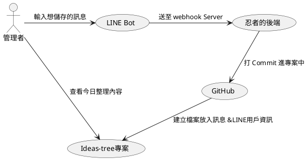

<iframe class="speakerdeck-iframe" frameborder="0" src="https://speakerdeck.com/player/9f9e836869da46879b027b8750fe43d1?slide=1" title="Life Hacker with LINE Bot and GitHub API" allowfullscreen="true" mozallowfullscreen="true" webkitallowfullscreen="true" style="border: 0px; background: padding-box padding-box rgba(0, 0, 0, 0.1); margin: 0px; padding: 0px; border-radius: 6px; box-shadow: rgba(0, 0, 0, 0.2) 0px 5px 40px; width: 560px; height: 314px;" data-ratio="1.78343949044586"></iframe>

# 前言

大家好，我是 LINE 台灣技術傳教士 - NiJia Lin，此次的內容於「中部人的聊天機器人小小聚 #22」分享，分享這陣子以來自己做的一個小專案，拋磚引玉希望能讓更多點子於社群上發酵，想了解更多分享的內容請繼續往下看吧！

- [活動頁](https://chatbots.kktix.cc/events/chatbots-meetup-in-central-taiwan-022)
- [簡報連結](https://speakerdeck.com/line_developers_tw/life-hacker-with-line-bot-and-github-api)

<!-- more -->

# 為什麼誕生這篇文章(分享)?

<iframe class="speakerdeck-iframe" frameborder="0" src="https://speakerdeck.com/player/9f9e836869da46879b027b8750fe43d1?slide=3" title="Life Hacker with LINE Bot and GitHub API" allowfullscreen="true" mozallowfullscreen="true" webkitallowfullscreen="true" style="border: 0px; background: padding-box padding-box rgba(0, 0, 0, 0.1); margin: 0px; padding: 0px; border-radius: 6px; box-shadow: rgba(0, 0, 0, 0.2) 0px 5px 40px; width: 560px; height: 314px;" data-ratio="1.78343949044586"></iframe>

- 訊息散落在個人群組、各種聊天室
- 「那個 OOO 網址借我放一下」，應該很常看到這句話?
- 平常喜歡看 GitHub
- 許多工作訊息、聊天內容都在 LINE 上面

> 因為上述原因誕生了這次的想法

# Part 1. 整合 GitHub API + LINE Bot

<iframe class="speakerdeck-iframe" frameborder="0" src="https://speakerdeck.com/player/9f9e836869da46879b027b8750fe43d1?slide=5" title="Life Hacker with LINE Bot and GitHub API" allowfullscreen="true" mozallowfullscreen="true" webkitallowfullscreen="true" style="border: 0px; background: padding-box padding-box rgba(0, 0, 0, 0.1); margin: 0px; padding: 0px; border-radius: 6px; box-shadow: rgba(0, 0, 0, 0.2) 0px 5px 40px; width: 560px; height: 314px;" data-ratio="1.78343949044586"></iframe>

首先我建立了一個專案叫做 [ideas-tree](https://github.com/louis70109/ideas-tree) 準備來放我日常收集的小點子，接著另外建立一個 [LINE Bot 專案](https://github.com/louis70109/line-bot-gitbub-actions-receiver)，專門來處理管理者(我)與 LINE Bot 放上的任何點子訊息。

<iframe class="speakerdeck-iframe" frameborder="0" src="https://speakerdeck.com/player/9f9e836869da46879b027b8750fe43d1?slide=6" title="Life Hacker with LINE Bot and GitHub API" allowfullscreen="true" mozallowfullscreen="true" webkitallowfullscreen="true" style="border: 0px; background: padding-box padding-box rgba(0, 0, 0, 0.1); margin: 0px; padding: 0px; border-radius: 6px; box-shadow: rgba(0, 0, 0, 0.2) 0px 5px 40px; width: 560px; height: 314px;" data-ratio="1.78343949044586"></iframe>

把服務叫起來之後於聊天室內打上訊息，即可把輸入的內容打到 [ideas-tree](https://github.com/louis70109/ideas-tree) 上面做紀錄，在這些過程中的流程請參考以下流程圖。

<iframe class="speakerdeck-iframe" frameborder="0" src="https://speakerdeck.com/player/9f9e836869da46879b027b8750fe43d1?slide=7" title="Life Hacker with LINE Bot and GitHub API" allowfullscreen="true" mozallowfullscreen="true" webkitallowfullscreen="true" style="border: 0px; background: padding-box padding-box rgba(0, 0, 0, 0.1); margin: 0px; padding: 0px; border-radius: 6px; box-shadow: rgba(0, 0, 0, 0.2) 0px 5px 40px; width: 560px; height: 314px;" data-ratio="1.78343949044586"></iframe>

結果大概像這樣，可以把輸入的大頭貼+人名放上，並且在以下放入在 LINE Bot 上輸入的內容。

## 使用 Markdown 轉 HTML 的 GitHub API

<iframe class="speakerdeck-iframe" frameborder="0" src="https://speakerdeck.com/player/9f9e836869da46879b027b8750fe43d1?slide=8" title="Life Hacker with LINE Bot and GitHub API" allowfullscreen="true" mozallowfullscreen="true" webkitallowfullscreen="true" style="border: 0px; background: padding-box padding-box rgba(0, 0, 0, 0.1); margin: 0px; padding: 0px; border-radius: 6px; box-shadow: rgba(0, 0, 0, 0.2) 0px 5px 40px; width: 560px; height: 314px;" data-ratio="1.78343949044586"></iframe>

雖然在手機上打 Markdown 格式不太方便，但因為有時候也會用到電腦紀錄資訊，因此還是當內容建立時格式化成 html 格式，如此以來即便是換行也可以被放進去，才不會輸入的訊息都變成同一行。

> 剛看到上面的檔案會寫 .md 檔案是為什麼呢? 原本是預計放入內容是 Markdown，但因為在使用之後覺得還是格式化成 html 是比較統一，因此在檔案的名稱上改成 .html 是比較正確的喔！

以下附一段 python code 給大家參考

<iframe class="speakerdeck-iframe" frameborder="0" src="https://speakerdeck.com/player/9f9e836869da46879b027b8750fe43d1?slide=9" title="Life Hacker with LINE Bot and GitHub API" allowfullscreen="true" mozallowfullscreen="true" webkitallowfullscreen="true" style="border: 0px; background: padding-box padding-box rgba(0, 0, 0, 0.1); margin: 0px; padding: 0px; border-radius: 6px; box-shadow: rgba(0, 0, 0, 0.2) 0px 5px 40px; width: 560px; height: 314px;" data-ratio="1.78343949044586"></iframe>

輸入完之後如上圖所示。

<iframe class="speakerdeck-iframe" frameborder="0" src="https://speakerdeck.com/player/9f9e836869da46879b027b8750fe43d1?slide=11" title="Life Hacker with LINE Bot and GitHub API" allowfullscreen="true" mozallowfullscreen="true" webkitallowfullscreen="true" style="border: 0px; background: padding-box padding-box rgba(0, 0, 0, 0.1); margin: 0px; padding: 0px; border-radius: 6px; box-shadow: rgba(0, 0, 0, 0.2) 0px 5px 40px; width: 560px; height: 314px;" data-ratio="1.78343949044586"></iframe>

因為透過 GitHub API 自動幫忙判斷使用的樣式，因此所有的內容擺放位置都已經幫忙調整好了，就不用自己想著到底要怎麼寫 html 了！說不定之後也可以使用 Markdown 格式寫一些東西，然後產生像是 Hackmd 那樣的輸出格式～也甚至有機會把它弄成 GitHub page 給大家看！

# Part 2. 每日透過 GitHub Actions 佈署上 GitHub Page

以下將會大家介紹一下我日常撰寫部落格時後續執行的自動部署與相關問題，以及為什麼要選擇 LINE Bot 作為我操作的介面👀
## 遇到的問題

- Hexo 部署跑編譯時偶爾會出現 timeout
- 一次部署大約在三分鐘左右，手動部署會很耗時
- 因為是透過 js 編譯，因此會有 node_module (比較肥)

## 為什麼用 LINE Bot 而不是 LINE Notify 呢？

<iframe class="speakerdeck-iframe" frameborder="0" src="https://speakerdeck.com/player/9f9e836869da46879b027b8750fe43d1?slide=15" title="Life Hacker with LINE Bot and GitHub API" allowfullscreen="true" mozallowfullscreen="true" webkitallowfullscreen="true" style="border: 0px; background: padding-box padding-box rgba(0, 0, 0, 0.1); margin: 0px; padding: 0px; border-radius: 6px; box-shadow: rgba(0, 0, 0, 0.2) 0px 5px 40px; width: 560px; height: 314px;" data-ratio="1.78343949044586"></iframe>

- 可以發送 flex message，除了比較漂亮外，可以做的事情也比較多
- LINE Bot 中可以獲取 user id ，可以間接做用戶辨識，避免機器人被發現亂打 commit
- 承上，做部署之類的事情可以更清楚是誰按的，不會死無對證

## 為什麼選擇 GitHub Actions？

<iframe class="speakerdeck-iframe" frameborder="0" src="https://speakerdeck.com/player/9f9e836869da46879b027b8750fe43d1?slide=16" title="Life Hacker with LINE Bot and GitHub API" allowfullscreen="true" mozallowfullscreen="true" webkitallowfullscreen="true" style="border: 0px; background: padding-box padding-box rgba(0, 0, 0, 0.1); margin: 0px; padding: 0px; border-radius: 6px; box-shadow: rgba(0, 0, 0, 0.2) 0px 5px 40px; width: 560px; height: 314px;" data-ratio="1.78343949044586"></iframe>

主要也是因為我的專案基本上都在 GitHub 上執行，因此透過 GitHub Actions 也是相對方便許多，不用再額外設定其他內容。

另一部分也因為無需架設，在GitHub上就可以無痛免費使用，且社群也相較於兩年前我使用時更加完整，有許多東西都可以參考使用，讓我們在實現點子時可以更加快速～

# 結論

<iframe class="speakerdeck-iframe" frameborder="0" src="https://speakerdeck.com/player/9f9e836869da46879b027b8750fe43d1?slide=18" title="Life Hacker with LINE Bot and GitHub API" allowfullscreen="true" mozallowfullscreen="true" webkitallowfullscreen="true" style="border: 0px; background: padding-box padding-box rgba(0, 0, 0, 0.1); margin: 0px; padding: 0px; border-radius: 6px; box-shadow: rgba(0, 0, 0, 0.2) 0px 5px 40px; width: 560px; height: 314px;" data-ratio="1.78343949044586"></iframe>

這次做的專案主要也是為了收集我日常尚未發酵的點子，接著安排每個週末把這週的內容好好整理，就可以更加收斂自己點子的發想了！

另外本來想介接 json2video 的服務，但因為測試的數量較少，想說未來如果真的需要想串接其他平台時可以再來使用～

最後也很鼓勵大家使用 LINE Bot 去做更多的應用，500 封免費的訊息相信對於日常使用應該是綽綽有餘，且也可以同步做身份認證，簡直就是一兼二顧：），後續有更多串接的應用我也會在持續分享給大家！

# 活動小結

立即加入「LINE 開發者官方社群」官方帳號，就能收到第一手 Meetup 活動，或與開發者計畫有關的最新消息的推播通知。▼

「LINE 開發者官方社群」官方帳號 ID：@line_tw_dev

# 關於「LINE 開發社群計畫」

LINE 於 2019 年開始在台灣啟動「LINE 開發社群計畫」，將長期投入人力與資源在台灣舉辦對內對外、線上線下的開發者社群聚會、徵才日、開發者大會等，已經舉辦 30 場以上的活動。歡迎讀者們能夠持續回來查看最新的狀況。詳情請看:

- [2021 年 LINE 開發社群計畫活動時程表](https://engineering.linecorp.com/zh-hant/blog/2021-line-tw-devrel/)
- [2020 年 LINE 開發社群計畫活動時程表](https://engineering.linecorp.com/zh-hant/blog/2020-line-tw-devrel/)
- [2019 年 LINE 開發社群計畫活動時程表](https://engineering.linecorp.com/zh-hant/blog/line-taiwan-developer-relations-2019-plan/)
- [LINE Taiwan Developer Relations 2019 回顧與 2019 開發社群計畫報告](https://engineering.linecorp.com/zh-hant/blog/line-taiwan-developer-relations-2019/)

