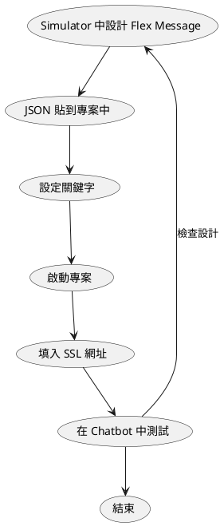

# 前言

平時開發 LINE Bot 相關功能時，我們都會使用許多的文字、貼圖、圖片...來實現一個服務所需要的對話流程，而在開發許久之後，總想為自己的 LINE Bot 添加更多有特色的內容，不論是在文字中加入特殊符號、發送對應情境的貼圖、影片..等等。而在 LINE Bot 中有個可以讓開發者自由添加各種特色的訊息選單 - [Flex Message](https://developers.line.biz/en/docs/messaging-api/using-flex-messages/)，那這個功能有什麼特別的呢？以及我可以如何快速測試使用這功能呢？以下就讓我為各位介紹介紹。

# 索引

- [Flex Message 簡介](https://nijialin.com/2021/06/09/line-flex-message-simulator/#Flex-Message-簡介)
- [如何設計與測試 Flex Message？使用 Flex Message Simulator](https://nijialin.com/2021/06/09/line-flex-message-simulator/#如何設計與測試-Flex-Message？使用-Flex-Message-Simulator)
- [其他範例提供](https://nijialin.com/2021/06/09/line-flex-message-simulator/#其他範例提供)
- [活動小結](https://nijialin.com/2021/06/09/line-flex-message-simulator/#活動小結)
- [關於「LINE-開發社群計畫」](https://nijialin.com/2021/06/09/line-flex-message-simulator/#關於「LINE-開發社群計畫」)
<!-- more -->

# [Flex Message](https://developers.line.biz/en/docs/messaging-api/using-flex-messages/) 簡介

Flex Message 是什麼？它是一個 LINE 很強大的訊息圖文選單，能夠讓開發者透過 JSON 的方式建立起漂亮的選單(如下)，讓 LINE 官方帳號(Official Account)的擁有者(Provider)可以使用設計過的訊息選單與用戶做更多的互動。

當中的許多設計概念與 CSS 的 [Flex Box](https://developer.mozilla.org/zh-TW/docs/Web/CSS/CSS_Flexible_Box_Layout/Basic_Concepts_of_Flexbox) 相似，如果有開發過前端的朋友也歡迎來試試看 LINE 的 Flex Message。

延伸閱讀：

- [使用 2020 Flex Message 的 10 個新功能 – 讓您在 LINE 的訊息設計更有彈性](https://engineering.linecorp.com/zh-hant/blog/2020-flex-message-10-reason/)
- [在 Vue3 中引入 LIFF 的 ShareTargetPicker 分享 FlexMessage 訊息給 LINE 好友](https://engineering.linecorp.com/zh-hant/blog/how-to-use-liff-in-vue3/)
- [Flex Message 的 Update 1 已公開](https://engineering.linecorp.com/zh-hant/blog/flex-message-update1/)
- [2020/10 Flex Message Update 2 released](https://developers.line.biz/en/news/2020/10/08/flex-message-update-2-released/)

# 如何設計與測試 Flex Message？使用 Flex Message Simulator

許多開發者在開發 Flex Message 給 Chatbot 或是 ShareTargetPicker ([參考文章](https://engineering.linecorp.com/zh-hant/blog/share-target-picker-liff/))時經常會透過 [LINE Simulator](https://developers.line.biz/flex-simulator) 來將想要的訊息格式透過介面上的操作選項來處理想發送在 LINE 平台上的內容，如下圖所示，為一開始進入 Simulator 頁面的初始狀態。

相信有在開發 Chatbot 的朋友對這個功能鐵定不陌生，而今天要介紹的部分則是近期在[官方新聞稿](https://developers.line.biz/en/news/2021/05/20/send-test-message-flex-message-simulator/)中釋出在介面上的新功能 - **發送測試訊息**，那這個功能有什麼特別？以及他解決了什麼問題呢？以下說明一個之前開發的範例流程：

光是在過程中只為了測試 Flex Message 在 LINE 中的表現是如何，可能就需要以上的步驟，以下就來介紹一下這次加入內**發送測試訊息**更新。

> 官方文件： [Using Flex Message Simulator to create a digital business card](https://developers.line.biz/en/docs/messaging-api/using-flex-message-simulator/)

首先進入 [Flex Message Simulator](https://developers.line.biz/flex-simulator/) 後，會看到樣式(左邊)、內容對照格式(中間)、以及右上角四個選項功能

從左至右本別是`新建(New)樣式`(Bubble、Carousel)、`展示案例`(Showcase)、`Send...`、`查看 JSON 樣式(View as JSON)`，這邊我們選擇 `Send...` 

點下去後會看到以下畫面，但**首次使用**時需要在 Simulator 上`綁定(註冊)` LINE 帳號，讓系統可以知道要發送給那個使用者的 Simulator 的測試帳號中。

點選`綁定(註冊)`後，掃描 QR Code 後即可在 LINE App 中收到驗證碼(以下為範例)

當綁定後讓 Simulator 認識你後，再次進入 [Flex Message Simulator](https://developers.line.biz/flex-simulator/)，將你想要的 Flex Message 的樣式(JSON)貼進去`View as JSON`中(或**自行建立**)，點選 `Send...` 之後出現**彈出視窗**後點選帳號旁的 **Radio box** (欲發送支帳號)並按下 **Send** 來發送測試訊息。

發送後即可看到視窗中會有以下的結果啦！帳號名稱為 **Flex Message Sim**，並且為一個**綠色盾牌**的帳號([盾牌功能請參考](https://tw.linebiz.com/service/account-solutions/line-official-account/))，進入後即可看到剛剛所發送的測試訊息囉！

# 其他範例提供

以下是我在開發 Side Project 時所使用的樣式，歡迎大家取用並開發出更多更吸睛的 Flex Message!

對戰範例一：

疊層範例二：

# 結論

在這次的更新此功能後幫助到許多持續在開發 Flex Message 的朋友(包括我)，讓我們可以用最少的流程來試試看自己在 Simulator 模擬器上所建立的 Flex Message 是否在手機、桌機上的表現與我們的想像一致，希望透過此功能可以讓各位開發相關功能時更加順暢，未來有新功能也會持續透過文章讓大家認識新功能。

# 活動小結

立即加入「LINE 開發者官方社群」官方帳號，就能收到第一手 Meetup 活動，或與開發者計畫有關的最新消息的推播通知。▼

「LINE 開發者官方社群」官方帳號 ID：@line_tw_dev

# 關於「LINE 開發社群計畫」

LINE 今年年初在台灣啟動「LINE 開發社群計畫」，將長期投入人力與資源在台灣舉辦對內對外、線上線下的開發者社群聚會、徵才日、開發者大會等，已經舉辦 30 場以上的活動。歡迎讀者們能夠持續回來察看最新的狀況。詳情請看:

- [2019 年 LINE 開發社群計畫活動時程表](https://engineering.linecorp.com/zh-hant/blog/line-taiwan-developer-relations-2019-plan/)
- [LINE Taiwan Developer Relations 2019 回顧與 2019 開發社群計畫報告](https://engineering.linecorp.com/zh-hant/blog/line-taiwan-developer-relations-2019/)
- [2020 年 LINE 開發社群計畫活動時程表](https://engineering.linecorp.com/zh-hant/blog/2020-line-tw-devrel/)
- [2021 年 LINE 開發社群計畫活動時程表 (持續更新)](https://engineering.linecorp.com/zh-hant/blog/2021-line-tw-devrel/)
