# 前言

延續上一篇「[幫 QR Code 加上背景圖，別只留下黑白！](https://nijialin.com/2023/02/05/nodejs-custom-qrcode-background/)」，因為只需要一個輸入框輸入網址、以及上傳一張圖片，想了想感覺就很適合透過 LINE Bot 來幫忙產生，以下就來跟大家介紹一下這次開發時的一些註解～

> NodeJS repository: https://github.com/louis70109/qrcode-background-generator

<!-- more -->

# 介紹

```puml
@startuml
User ->LINE_Bot: 傳送文字
LINE_Bot -> Server: Webhook 傳送資訊
Server -> LINE_Bot: 把文字存入記憶體(Sqlite)
LINE_Bot -> User: 回傳文字供用戶確認

User->LINE_Bot: 傳送正方形圖片
LINE_Bot->Server:傳送 Message Id
Server->GitHub: 下載 Buffer 並上傳 QR Code 圖片
GitHub->Server: 回傳網址
Server->LINE_Bot: 回傳網址文字
LINE_Bot->User: 提供用戶下載原圖
@enduml

```

## 為什麼用 LINE Bot?

對我來說，因為我時常會手機跟電腦頻繁切換，因此即便在電腦上有存在書籤，但在手機上則可能會弄丟網址，而做成 Bot 就不容易弄丟，只要打開 LINE 即可。

因為這次的`流程`只需要兩步驟，因此就不用勞煩前端或 LIFF，也讓我這後端工程師少寫點不熟悉的 HTML ... XD

### 圖片存哪好？

我自己是透過 GitHub 的方式來儲存圖片(畢竟公有雲之類的放太多還是會需要儲存費)，詳細可參考「[在 GCS || GitHub 上傳圖片並取得網址](https://nijialin.com/2022/10/02/upload-image-get-url-ways/)」。

> https://raw.githubusercontent.com/帳號/專案/master/檔案.png

但若串接 LINE Bot 上放入該檔案連結，在桌機版(v7.13)上目前會顯示不出來，但手機顯示的出來，目前還不確定實際原因。另外考量下載傳輸過程是會`壓縮圖片`(增加性能)，因此在實作上還是以傳連結的方式，讓使用者可以抓到原檔的大小，不會被平台壓縮。

> 良心建議: 上傳到 GitHub 專案上只是暫時解，建議還是放在自己的 S3 || Cloud Storage 比較好喔！😁

## Talk too more, show me video!!

<iframe width="560" height="315" src="https://www.youtube.com/embed/V8Q0b6ZFmbE" title="YouTube video player" frameborder="0" allow="accelerometer; autoplay; clipboard-write; encrypted-media; gyroscope; picture-in-picture; web-share" allowfullscreen></iframe>

歡迎大家搬去自己的地方使用：[GitHub URL](https://github.com/louis70109/qrcode-background-generator)

## [環境變數說明](https://github.com/louis70109/qrcode-background-generator/blob/main/.env.sample)

- CHANNEL_ACCESS_TOKEN=
  - LINE Bot 使用
- CHANNEL_SECRET=
  - LINE Bot 驗證使用
- NODE_ENV=developer
  - Developer 模式會讀取 .env 檔
- BASE_URL=
  - 當時哪來建立 ngrok 使用，不用管它
- NGROK_TOKEN=
  - 跟上面一樣，不用管它
- GITHUB=
  - 請放上 GitHub developer token，並修改[程式碼中 repo 的名稱](https://github.com/louis70109/qrcode-background-generator/blob/main/utils/github.js#L17)

# 結論

現在工具百百種，如果能運用這些技術解決日常生活中的問題就在好不過了！以上內容推薦給大家，如果看完本篇你也有相關的想法，歡迎以下留言給我知道唷！那我們下期見，西Ｕ～🥷

