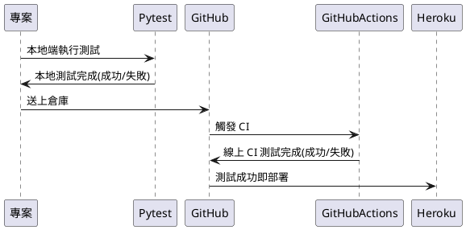

<style>
  section.compact {
    font-size: 150%  
  }
  img[alt~="center"] {
    display: block;
    margin: 0 auto;
  }
</style>


# 前言

過往在寫應用程式時總是為了趕上線  將程式寫完之後即部署，但往往總是上線後才發生了一些可預期的錯誤，導致工時增加，因此在撰寫程式時若有自動測試的程式碼，透過測試增加來程式碼的品質，為上線前做一個最後的把關。

而近期在寫 Side Project - [P+ League Bot](https://github.com/louis70109/PLeagueBot) 時包裝了一些程式碼(FlexMessage、SQL Query...)，但再將資料庫函式改成 ORM - SQLAlchemy 時導致了一些上線錯誤，因此就開始補測試程式碼避免往後再有此類問題產生，本篇則紀錄使用 Pytest 時的一些小知識。



<!-- more -->

# 介紹

## Mock 是什麼？為什麼要用它？

Mock 按造字面上解釋就是 **模擬**，在許多的測試中(單元、整合、黑/白箱、回歸測試...)都可能因環境限制導致一些函式無法在測試中執行完成，因此這個時候就需要使用 Mock 來模擬回傳值，以下 [pytest](https://docs.pytest.org/en/stable/) 搭配 unittest 函式庫加上一些範例帶大家使用。

> 小知識：Mock 時只會模擬引入的的物件(import xxx...)，因此設定 Mock 變數要調整在測試裡的使用方法。

## Class vs Function

### TL; DR

- 物件(Class)不會有回傳值，因此不用 return_value
- 函式(Function)若有回傳值(return ooo)，則需要 return_value

### Function 說明

許多時候在撰寫程式碼時為了區分邏輯，會很習慣將某個區塊包裝成函式來表示它的用途， 既然在測試中要使用 Mock 來模擬函式的**回傳值**，我們就需要在 pytest 中使用 **return_value** 來幫助我們在執行函式時模擬一個回傳值，範例如下：

```python
from mock import patch
import unittest

class TestClient(unittest.TestCase):
  @patch('path.to.function')
  def test_campaign(mock_function):
    mock_function.return_value = {'foo': 'bar'}
    ...
```

### 步驟說明

1. `@patch`: 從當前專案目錄出發，以 `"."` 的方式代表路徑，最後一個值通常為要 Mock 的**物件(class)**/**函式(function)**。
2. `mock_function`: 代表你剛剛模擬的**物件**/**函式**。
3. `mock_function.return_value`: 如果為函式並且有回傳值，則接 **return_value**，若為**物件(class)**則無需接任何參數。

### Class + Function 使用說明

這邊以常見的 SQLAlchemy 為例，一般都會先定義一個 Model，這邊我使用我的 PleagueBot 的[ Stream 為例](https://github.com/louis70109/PLeagueBot/blob/master/models/stream.py#L8)，並使用他去查詢:

```python
from models import Stream
...
rows: list[Stream] = Stream.query.order_by(text("stream.id desc")).limit(12).all()
```

因為是從 models 這個資料夾引入 Stream 這個 Class 物件，此時在測試時模擬這段時就要這樣寫：

```python
@patch('models.Stream')
def test_stream(mock_stream):
    mock_stream.query.order_by.return_value.limit.return_value.all.return_value = {'foo': 'bar'}
```

### 小結

- 測試的函式不需接函式裡面的參數值
- 為什麼要一直接 **return_value**？因為程式為一層一層接下去，每一層都會有個回傳值，因此就需要一直接著下去讓 `rows` 這個變數的值得到正確的回傳值。
  - 用錯的話印出來會看到 MagicMock 的物件在裡面，此時就代表有地方沒處理好。
  - 若要更詳細每個函式的回傳值，則可以分開寫。
- 可以使用 **assert_called_once()** 來確保該 Mock 值在測試階段是否有被順利執行一次。

## 全域(Global)變數怎麼處理？使用 MonkeyPatch 來處理

一個應用程式中多少都會有些全域變數，可能是**環境變數**或是某些**設定值**(**預設值**)，常見一般都是**全大寫**代表全域變數居多。但是在單元測試時通常都只針對某個函式去處理，在函式外層的全域變數要怎麼處理呢？這裡我使用 MonkeyPatch 來針對變數做處理，使用 **setattr**(更多用法參考[官方文件](https://docs.pytest.org/en/stable/monkeypatch.html))，範例如下：

```python
from _pytest.monkeypatch import MonkeyPatch
class TestClient(unittest.TestCase):
    def setUp(self):
        MonkeyPatch().setattr('utils.flex.SHARE_LINK', "https://liff.line.me/TEST_ID")
```

1. 在 **utils** 資料夾下的 **flex.py** 有個 **SHARE_LINK** 的全域變數，將它設定為 https://liff.line.me/TEST_ID。
2. pytest 內建有 MonkeyPatch，引入時要注意。
3. 用法與 Mock 雷同，路徑一樣是用 `"."` 來代表，最後一個值則為**目標物件**(**變數**)。
4. 放在 setUp 代表在測試程式開始跑的初始階段，即設定相關模擬參數。

## 期望值過長？放成 JSON 檔吧！

這邊是組合應用，以 LINE Bot 的 [Flex Message 為例](https://developers.line.biz/en/reference/messaging-api/#f-carousel)，常常要輸出時 JSON 都可能是幾百行，放在測試函式中會造成讀取上的困擾(佔版面)，因此這裡我推薦使用一個檔案把期望值存下來，並用開檔案的方式讀取資料，如下：

```python
f = open(os.path.abspath(os.path.dirname(__file__))+'/tests/rank_flex.json')
expected = json.load(f)
f.close()
```

## 下 Pytest 指令都沒反應？

Python 在以前的版本有個規定就是需要在資料夾下加入 **\_\_init\_\_\.py** 這個檔案，雖然在 3 版之後可以不需加入這檔案，但因為許多套件都需要向下相容支援 2 版的用戶，還是會需要在資料夾下 **\_\_init\_\_\.py**，因此若在執行 pytest 時沒有看到類似以下的資訊，就代表在你的測試資料夾下需要加入 **\_\_init\_\_\.py** 的空檔案喔！

```
collected 10 items

tests/test_flex.py ..........             [100%]
```

# 結論

藉由此篇記錄一些每次回來寫測試時容易遇到的問題，透過此篇整理也讓我對於使用上有更清楚了些，讓 Side Project 也可以有品質的加持 😊，之後若有學到相關做法也會再持續更新！
