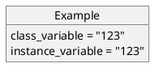
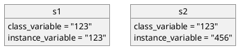
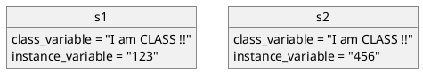
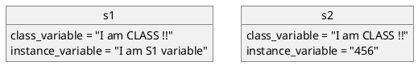

# 前言

常常在寫程式時沒搞清楚作用域時很容易留坑或邏輯混亂，因此花時間理解每個語言的作用域也很重要。

之前因為專案有踩過一些坑，而大家在看套件時很能很常看到類似以下的 code：

<!-- more -->

```python
class Client:
    CLIENT_ID = os.environ.get('LINE_NOTIFY_CLIENT_ID')
    CLIENT_SECRET = os.environ.get('LINE_NOTIFY_CLIENT_SECRET')
    REDIRECT_URI = os.environ.get('LINE_NOTIFY_REDIRECT_URI')

    def __init__(self,
                 client_id=None,
                 client_secret=None,
                 redirect_uri=None):
        self.client_id = client_id or self.CLIENT_ID
        self.client_secret = client_secret or self.CLIENT_SECRET
        self.redirect_uri = redirect_uri or self.REDIRECT_URI
```

> [Lotify](https://github.com/louis70109/lotify/blob/master/lotify/client.py#L9) 當中的片段

因時常會搞不清楚為什麼參數會到處定義，接下來就介紹一下 Class 與 Instance 層級變數的差異。

# 介紹

以上述例子而言，在 Class 宣告完後會看到 CLIENT_ID、CLIENT_SECRET、REDIRECT_URI 這三個參數，在這層的變數就是 `"Class Level"`，而在 \_\_init\_\_ 下面三個變數 self.client_id、self.client_secret、self.redirect_url 就是待會會提到的 `"Instance Level"`。

## Class Level

CLIENT_ID、CLIENT_SECRET、REDIRECT_URI 這三個參數是被所有有初始化 Client 的 Instances 使用，也就是說當數值改變時其他的 Instance 裡的 Class Level 參數也會跟著改變，在這層操作參數時要特別小心，因為只要改動到值是大家一起改，所以說若有一個地方給錯就其他的 Instance 都會一起錯。

## Instance Level

Instance 作用域只會在初始化後的那個物件身上，每個物件的`參數`間都是獨立的，而 Python 裡面定義的參數位置就在 \_\_init\_\_ 裡面，因此會大部分的程式碼定義的層級幾乎都會在 Instance Level。

> 若在這還是看不懂的話現在會有實作範例。

## Bonus - self 到底在指誰？

初學的一定很容易搞混這個部分，因為兩個層級基本上是共用同一個 `self`，因此在變數的宣告上 class level 我一般習慣用全大寫，意指在 Class level 這層的「全域變數」，而小寫則是在 Instance level 中的「區域變數」，這個習慣基本上在每個語言間都是通用，因此在定義變數時若發現大小寫時記得要注意喔！

# 實作一個範例

製作一個 Example 的類別，包含著 `class_variable` 以及 `instance_variable` 兩個變數，其中 `instance_variable` 首次附值若初始化沒定義 instance_variable 的話則為 class_variable 的值 `123`：

```python
class Example:
     class_variable = 123
     def __init__(self, instance_variable=None):
         self.instance_variable = instance_variable or type(self).class_variable
```

Example 的類別(Class)物件值如下：



接著宣告`s1` & `s2` 兩個 Instance 來做實驗：



```python
s1 = Example()
s2 = Example(456)

s1.class_variable     # 123
s2.class_variable     # 123
```

此時因為初始化所以值都會 `123`，接下來直接改 Example 的 class 為 `"I am CLASS !!"`：



```python
#  直接改 Example 類別的值
Example.class_variable = "I am CLASS !!"

#  印出 class_variable & instance_variable
print(s1.class_variable)     # 'I am CLASS !!'
print(s1.instance_variable)  # 123
print(s2.class_variable)     # 'I am CLASS !!'
print(s2.instance_variable)  # 456
```

從上述實驗中驗證了 class Level 層級的變數在 s1 以及 s2 這兩個 Instance 中是共用的，接著來實驗 Instance 層級的變數：

```python
print(s1.instance_variable)  # 123
print(s2.instance_variable)  # 456

# 修改 s1 的值
s1.instance_variable = "I am S1 variable"

print(s1.instance_variable)  # "I am S1 variable"
print(s2.instance_variable)  # 456
```



從這實驗中能看到個別 Instance 之間的參數不會互相影響，因此再更改變數值前記得要先了解當前的層級在哪才不會失手改錯造成問題。

# 結論

Class 層級的變數很適合給`環境變數`、`系統參數`，通常這兩個值影響都會是整個專案，而 Instance 之間因為不會互相影響所以適用於獨立情境中，例如 `Model 定義`、`JSON 物件` 就很適合。

```python
class Client:
    CLIENT_ID = os.environ.get('LINE_NOTIFY_CLIENT_ID')
    CLIENT_SECRET = os.environ.get('LINE_NOTIFY_CLIENT_SECRET')
    REDIRECT_URI = os.environ.get('LINE_NOTIFY_REDIRECT_URI')
```

> 參考 [Lotify 範例](https://github.com/louis70109/lotify/blob/master/lotify/client.py)

透過幾個簡單的例子也了解到變數在定義時的位置是`很重要的`，因此不管在寫套件或是專案時要注意一下變數的位置以防出問題喔！
