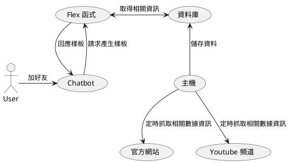

<style>
  section.compact {
    font-size: 150%  
  }
  img[alt~="center"] {
    display: block;
    margin: 0 auto;
  }
</style>

# 前言


跟在實事上的任何作品我相信都紅很快，如 口罩地圖、動森揪團系統...，只是這些題目紅的時候我個人沒有那麼大的憧憬去做相關題目。去年原本有`東南亞職業聯賽`(**ABL**)，我也做了一隻 Chatbot，只是當時用比較土炮的方法用 CSV 輸入議程，每次查詢時都進 CSV 查詢，但也適逢疫情關係而聯盟停辦進而機器人荒廢。但在最近出現了一個籃球新聯盟 `P+ league`，而我既然學 Python 也一段時間了也該拿來試試看爬蟲，因此下定決定開爬，以下會記錄一下在這過程中我有遇到的問題。

- [P+ League 助理](https://github.com/louis70109/PLeagueBot)
- [加入好友](https://line.me/R/ti/p/%40611lsquw)
<!-- more -->

# 流程



過往在很習慣寫完一個 side project 就在技術社團發文介紹作品，但因為 Chatbot 較多是在應用層面，因此主力若在技術社團上發則會可能會遇到一些問題：

- 受眾不同
- 面向不是範例或是研究的 Code

因此在這次我就嘗試了新的作法：

- 尋找 ptt 台灣相關籃球的版，最後找到`basketballTW`
- Facebook 一樣找一輪，找到 [P.LEAGUE + 台灣新職業籃球聯賽 (球迷討論區)](https://www.facebook.com/groups/292574422078791)
- LINE OpenChat 有貼，但目前只有一個隊伍有討論區，效果有限
- 結合 Chatbot 與 LIFF 的 ShareTargetPicker 的分享，把影片、戰績、比分分享給朋友
  - [ShareTargetPicker 文件](https://developers.line.biz/en/reference/liff/#share-target-picker)

這之間看著各個社群的推推(像是 [ptt](https://www.ptt.cc/bbs/basketballTW/M.1610890596.A.AA5.html))真的很有成就感 😁，也讓好友達到目前的 **450+**，當然再也別吝嗇將服務推上 GitHub 並社群的朋友可以借鏡來開發更多不一樣的服務，既然分享了我好友成長的途徑，積下來就來看一下我當中的一些技術方面註解吧！

# Flex 與 Carousel 如何共用同個 content (內容)

一般開發上很容易將 Flex 與 Carousel 搞混，剛好在這裡開發就一起分享，Carousel 與我們常在 [Flex Message Simulator](https://developers.line.biz/flex-simulator/) 上複製的 JSON 當中 bubble 是同一層，詳細可以參考[官方文件](https://developers.line.biz/en/docs/messaging-api/flex-message-elements/#container)。

但在我們最後要回應給 LINE 時會發類似以下的訊息:

```python
line_bot_api.reply_message(
    event.reply_token,
    messages=FlexSendMessage(
      alt_text="測試訊息",
      contents=content,
  )
)
```

最後與 LINE 對應的都會是 Flex Message 而不是 Carousel，這邊在再開發時需要多注意。

那現在知道 Bubble 與 Carousel 是同一層了，那兩者的差異在哪呢？Bubble 屬於一個較有彈性的樣式，雖然在文件中定義與 Carousel 同樣，但它是可以被放在 Carousel 裡面，到這邊大家應該有點搞混了，我們直接用範例展示。


以**P+ 助理**新聞為例，當前的 Carousel 則是由一堆 Bubble 所組成的，Code 則會像以下：

```python
line_bot_api.reply_message(
    event.reply_token,
    messages=FlexSendMessage(
      alt_text="測試訊息",
      contents={
        "type": "carousel",
        "contents": [{'type': 'bubble', ...以下省略樣式1}, {'type': 'bubble', ...以下省略樣式2}]
      },
  )
)
```

若今天我只是要送單一 Flex Message 訊息，此時我只要送一個 Bubble 的內容，因此樣式會長的像這樣：

```python
line_bot_api.reply_message(
    event.reply_token,
    messages=FlexSendMessage(
      alt_text="測試訊息",
      contents={'type': 'bubble', ...以下省略樣式1},
  )
)
```

有看到不一樣的地方嗎？沒錯差異只差再多了一個 `"type": "carousel"` 的資訊，並指把很多的 Bubble 透過迴圈的方式**加入**陣列中，讓訊息能以圖卡的方式顯示，因此在這邊就可以把 FlexSendMessage 裡面的 `contents` 包裝成一個函式，透過一些簡易的判斷式來決定它輸出是 Carousel 或 單一 Bubble 訊息，將內容依照型別放入後出去就都沒問題囉！但要注意的是 contents 裡面不論是**陣列**或是**物件**都要是 Bubble 的 Type，才避免放入後出錯。

```python
def message_type_condition(alt: str, contents: list or dict):
  output_flex_message: dict = {}
  if type(contents) == list:
    output_flex_message = {
        "type": "carousel",
        "contents": [*contents]
      }
  else:
    output_flex_message = {**contents}

  return FlexSendMessage(
      alt_text=alt,
      contents=contents,
  )
```

到這有點離題了，讓我把主軸拉回 P+ Chatbot 身上吧！

# 爬蟲時遇到 User-Agent 問題

在開頭有看到整個服務的流程，在這個服務上最重要的就是爬蟲功能，當中我上線時遇到的第一個問題就是：在本地端爬蟲都可以順利抓到資料，但一上 Heroku 之後想說 Chatbot 沒反應，是不是資料庫沒資料？使用 `heroku run bash` 進去跑一次腳本之後發現陣列值都時空的(本地可以上線不行)？因此就乾脆把網頁內容整個印出來(範例)：

```python
import requests
from bs4 import BeautifulSoup

res = requests.get('https://example.com')
soup = BeautifulSoup(res.content, 'html.parser')

print(soup.pretty())
```

發現一個很驚人的問題！當中的錯誤訊息認為我不是網頁因此擋下我的爬蟲(錯誤訊息待查)，實際原因是因為我沒有設定 `User-Agent` ([參考](https://stackoverflow.com/questions/27652543/how-to-use-python-requests-to-fake-a-browser-visit-a-k-a-and-generate-user-agent))，最後就將它加上，如下：

```python
res = requests.get('https://example.com', headers={
        'User-Agent': 'Firefox browser\'s user-agent',
})
```

> 這邊因為網站算小，因此不會有快取上的問題，而若讀者有遇到可以[參考設定](https://stackoverflow.com/questions/53899170/python-3-beautifulsoup-and-cache)

過程中當然也別太頻繁去爬網站避免被擋下來，我設定白天每三個小時爬一次並同步於資料庫，而半夜則讓 Heroku 睡覺，如此一來就可以確保服務流程順暢啦。

# 結論

由於這些作品大部分都只是 Side Project，在功能的釋出上相對會較慢，且因為當前好友不多，因此我對於 Chatbot 的規劃則是一個月才通知所有使用者(藉由 Push Message 推播)，相信這樣的內容對於開發者(我)或是用戶的通知的次數也都會控制得較好(不會頻繁推播而被封鎖)，因此大家在 LINE 上開發 Chatbot 時評估功能盡量以 Reply 完成，真的有訊息一定給使用者的知道才推播，一方面避免浪費多餘的費用也能降低被封鎖率喔！希望此篇文章能對於你再開發 Chatbot 上有幫助


