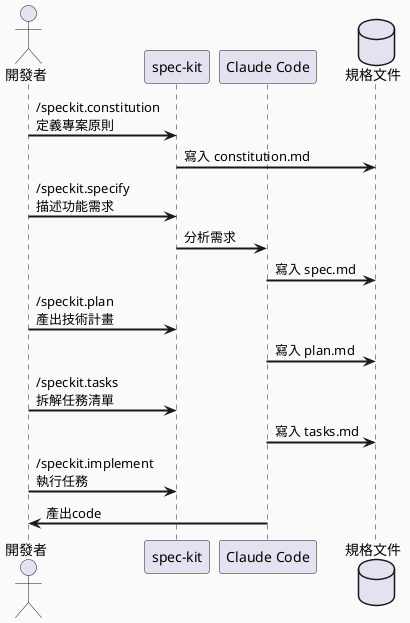
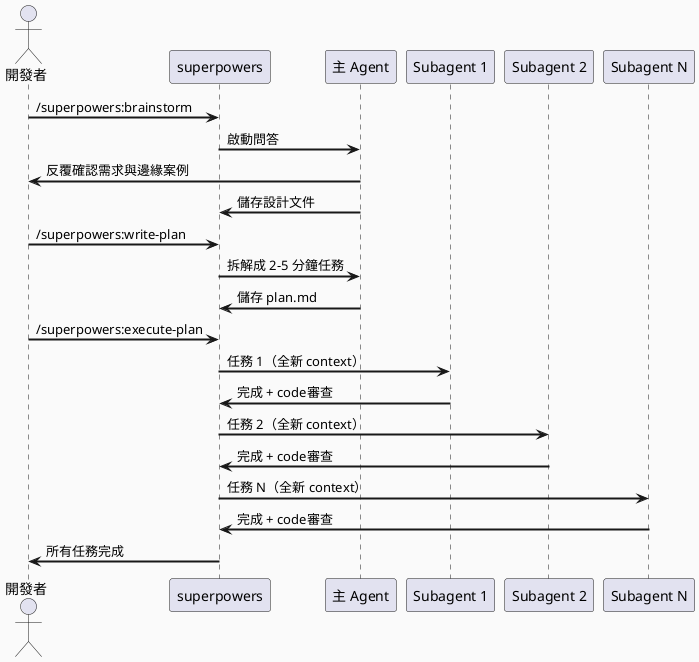
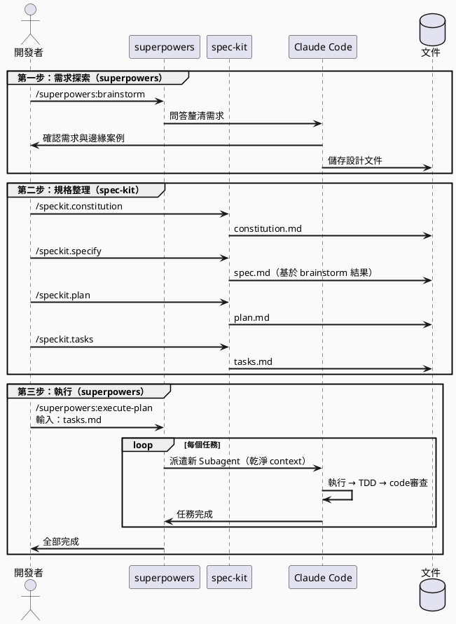

# 前言

最近在用 Claude Code 玩一些 side project，踩到了兩個工具：**spec-kit** 跟 **superpowers**。

老實說一開始看到這兩個工具的介紹時有點懶，又是一堆新東西要學😂，而且看起來好像功能差不多？但用了一陣子後發現它們的定位其實差很多，而且搭配起來用還滿有意思的。


<!-- more -->

---

# 兩個工具是什麼？

## spec-kit：先把規格寫清楚再說

spec-kit 是 GitHub 官方出品的工具，核心概念叫做 **Spec-Driven Development（SDD）**，意思是在動手寫code之前，先把規格文件整理好，讓文件成為整個開發過程的依據。

安裝方式：

```bash
uv tool install specify-cli --from git+https://github.com/github/spec-kit.git
specify init <project_name> --ai claude
```

它的流程就是五個指令依序走：

| 指令 | 在做什麼 |
|------|----------|
| `/speckit.constitution` | 定義專案原則，像是你的開發規範 |
| `/speckit.specify` | 描述你要做什麼功能 |
| `/speckit.plan` | 產出技術實施計畫 |
| `/speckit.tasks` | 把計畫拆成一個一個可執行的任務 |
| `/speckit.implement` | 執行任務，開始產code |

一路走完之後你手上會有一疊文件，對於新專案的初始化或是維護既有專案（先整理清楚現況）都還滿實用的。支援的 AI 也很多，Claude Code、Copilot、Cursor、Gemini 都可以用。

---

## superpowers：不讓 AI 直接衝去寫code

superpowers 是社群開發者 Jesse Vincent 打造的，他把這個工具定位成「方法論執行器」，核心問題是：**AI 很容易一接到需求就直接開始寫code，但這樣往往做歪或做錯。**

它透過在 Session 啟動時注入一套強制流程，逼 AI（其實也是逼你自己）先想清楚再動手。

安裝方式（Claude Code Marketplace）：

```
/plugin marketplace add obra/superpowers-marketplace
/plugin install superpowers@superpowers-marketplace
```

主要流程：

| 指令 | 在做什麼 |
|------|----------|
| `/superpowers:brainstorm` | Socratic 問答，釐清需求跟邊緣案例 |
| `/superpowers:write-plan` | 把需求拆成 2-5 分鐘可完成的小任務 |
| `/superpowers:execute-plan` | 每個任務派一個全新的 subagent 來執行 |
| 自動code review | 先查規格符合度，再查code品質，有大問題會擋住進度 |

它最有趣的設計是 **subagent 架構**：每個任務都開一個新的 AI agent，各自有乾淨的 context window，不會因為對話越來越長讓 AI 「腦袋越來越滿」。

---

# 實戰流程

## 單獨用 spec-kit

這是最直觀的用法，需求夠清楚的話，就直接照著五個指令走。



適合的場景：
- 小型新專案想快速起頭
- 維護老專案，先把現況整理成文件
- 想要產出給團隊看的結構化文件

---

## 單獨用 superpowers

superpowers 的亮點是 subagent 這個設計，每個任務都是全新的 agent 在跑，context 不會一直累積。



適合的場景：
- 需求還很模糊，需要先問清楚
- 任務量大，擔心 AI 跑著跑著品質越來越差
- 想要有 TDD 跟自動 code review 的流程

---

## superpowers + spec-kit 一起用

這個組合才是最完整的，superpowers 的作者 Jesse Vincent 在 GitHub Issue 裡也親自說過：

> "sounds like the two tools work well together. Brainstorming for ideation, then spec-kit for formalizing requirements."



邏輯上是：

1. **superpowers brainstorm** 負責「想清楚」，用問答挖出你自己沒想到的需求
2. **spec-kit** 把 brainstorm 結果轉成結構化文件，有據可依
3. **superpowers execute-plan** 拿著 spec-kit 產出的任務清單，一個一個用 subagent 跑

這樣兩個工具各有分工，不衝突。

---

# Token 效率觀察

## 兩種不同的省 Token 策略

| 策略 | spec-kit | superpowers |
|------|----------|-------------|
| 主要方式 | 規格寫到磁碟，按需讀取 | 每個任務開全新 subagent |
| 啟動 context | 視規格文件大小 | 約 2k token（非常小） |
| 技能載入 | 指令觸發 | 按需載入（shell script） |
| 累積風險 | 單一對話越來越長 | 任務間不共享 context |

superpowers 的設計在理論上比較不會遇到「對話越長、AI 越廢」的問題，因為每個 subagent 都重新開始。spec-kit 則是把文件寫到磁碟來控制 context 大小。

## Claude Pro 方案的殘酷現實

老實說，兩個工具我用下來，大概都是 **1.5 小時**就碰到 rate limit。

所以真的很難有量化的比較，也不敢說哪個比較省——限制不在工具，而在訂閱方案的配額。

但用的過程中有幾個觀察：

- 兩個工具都會把計畫或文件存到磁碟，**session 中斷後可以繼續**，這點很重要
- 如果你把 brainstorm 跟 implement 放在同一個 session 裡做，配額消耗會比拆開來做更多
- 任務切越小，單次對話越短，比較不容易在做到一半時撞到 rate limit

> 我自己的無腦用法是：用一個 session 想清楚、把文件搞定，碰到 rate limit 就等，下個 session 再繼續執行。很不優雅，但有用。

---

# 一句話總結

| | spec-kit | superpowers |
|---|---|---|
| 出品方 | GitHub 官方 | 社群（Jesse Vincent） |
| 核心定位 | 規格文件化 + code生成 | 流程管控 + subagent 執行 |
| TDD | 不是核心 | 強制執行 |
| code審查 | 無 | 有，阻斷嚴重問題 |
| 適合狀況 | 需求清楚、需要文件輸出 | 需求模糊、任務量大 |

**只能選一個的話：**
- 需求已經清楚、主要想要文件和code → **spec-kit**
- 需求還在摸索，或是任務量大、在意code品質 → **superpowers**

**想要完整流程：** superpowers brainstorm → spec-kit 整理文件 → superpowers execute-plan 執行

說到底，這兩個工具背後想教的事情是一樣的：**不要一拿到需求就叫 AI 開始寫code**。先想清楚，再讓 AI 動手，成果差很多。

---

# 參考資料

- [obra/superpowers - GitHub](https://github.com/obra/superpowers)
- [github/spec-kit - GitHub](https://github.com/github/spec-kit)
- [Superpowers + spec-kit? Issue #163](https://github.com/obra/superpowers/issues/163)
- [Superpowers Plugin for Claude Code: The Complete Tutorial - Namiru.ai](https://namiru.ai/blog/superpowers-plugin-for-claude-code-the-complete-tutorial)
- [Diving Into Spec-Driven Development With GitHub Spec Kit - Microsoft Developer Blog](https://developer.microsoft.com/blog/spec-driven-development-spec-kit)
