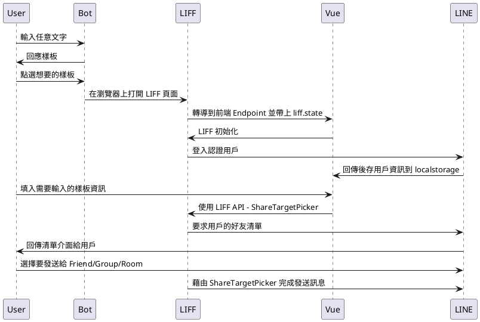

# 他怎麼出現的？

當時因為**公司**、**社群**、**工作坊**以及**各種朋友群組**都會需要分享各種活動資訊，包括活動告知、訂位消息、個人資訊卡、新聞...而每個需求中都剛好包含著其他功能 🔧，有時用 JavaScript、有時 Python，而每次寫的 Flex Message 就會散落在各地，東西、時間一多都會忘了當時做的東西在哪 💦，也就浪費當時花費的精力，而且在微服務這麼盛行的現今怎能不切出來呢 🤔


<!-- more -->

# 為什麼需要特別獨立 API？

如果你也是喜歡做 LINE Bot，或是經常拿來做許多的 Demo(簡易使用者介面展示、各種 API 溝通技巧...)，那你會很需要架設獨立一個 API。

- [Share Target Picker](https://developers.line.biz/en/reference/liff/#share-target-picker)
  - 分享給各種群組
- 提供給其他性質 Side Project 使用 Flex Message
- LINE 來說在回應時(Reply)只收 Flex Message 的樣板，而發送時會依照內容需求置換成 Carousel 或 Bubble，因此在 [Simulator](https://developers.line.biz/flex-simulator/) 上取得的 JSON 外面還是要再包一層 Flex，透過共用的 API 來說就可以省去**每次重新開發都忘記包 Flex 的這件事了**。（切身之痛！）

> 專案位置 [louis70109/Announcer](https://github.com/louis70109/Announcer)


# 專案介紹

## 環境變數

```
NODE_ENV=develop
CONCAT_ID=
CHANNEL_ACCESS_TOKEN=
CHANNEL_SECRET=
GA=
LOGGING=false
```

- `NODE_ENV`: 開發環境會引入 `.env` 檔案，預設為 **develop**
  - `if (process.env.NODE_ENV === 'develop') require('dotenv').config()`
- `CONCAT_ID`: 如果有使用 LIFF 的 [ShareTargetPicker](https://developers.line.biz/en/reference/liff/#share-target-picker) 分享，會把 LIFF 參數都放在此專案中
- `CHANNEL_ACCESS_TOKEN`: 如稍早看到的 LINE Bot 顯示畫面，讓管理者(我)可以透過 LINE Bot 來分享訊息
- `CHANNEL_SECRET`: 如上
- `GA`: 發 Flex Message 都有偷塞一個很小 pixel 的地方，只要有點到都會被計算。(做法來自 LAE 均民的[部落格文章](https://taichunmin.idv.tw/blog/))
- `LOGGING`: Debug 需要用的參數

# 如何快速部署

參考專案中的[文件 README](https://github.com/louis70109/Announcer/blob/master/README.md) 下方的 Heroku 部署按鈕即可快速部署到正式環境上，並把剛剛最主要的 LINE Bot 的兩個 Key、LIFF 的 **CONCAT_ID** 填入值，以及 **NODE_ENV** 改成 **production**，即可第一步快速上線並使用它。


## 使用

如果還不確定要不要使用，歡迎大家加入[此篇介紹的 LINE Bot 好友](https://line.me/R/ti/p/%40608zklsi)，加入後任意打字即會出現樣板

- [連結](https://line.me/R/ti/p/%40608zklsi)


### API 路由

- `/`: 健康確認
- `/liff`: 取得 LIFF ID
- `/liff/share`: 取得 Flex Message Template
- `/webhooks/line`: 設定 LINE Bot 時 webhook 所需要的路由
## 搭配前端 LIFF 頁面做使用

除了讓其他服務呼叫取得 Flex Message 以外，稍早也有說到會使用 [Share Target Picker](https://developers.line.biz/en/reference/liff/#share-target-picker) 功能來分享漂亮訊息給好友，因此這邊若你也有自己打造前端的話，歡迎參考[另一個前端專案 - Announcer](https://github.com/louis70109/announcer-vue) 及以下流程:



> 當然以上是一個簡易的請求流程，會依照大家的需求去決定流程要怎麼變通。

## 樣板們 - [更多請看這](https://github.com/louis70109/Announcer)

### Template 1


```javascript
{
    template: '1',
    title: 'Title',
    place: 'location',
    time: '12/26 15:00',
    url: 'HTTP string',
    imageUrl: 'HTTP string',
    description: 'aaa\nbbb\nccc',
    activity: 'some tag',
};
```

### Template 2


```javascript
staffList = {
  template: '2',
  title: 'title',
  place: 'here',
  url: 'HTTP link',
  activity: 'tag',
  map: 'Google Map link',
  people: [{name: 'NiJia', time: '10:00~12:00'}],
};
```

### Template 3


```javascript
Card = {
  template: '2',
  title: 'title',
  description: 'aaa\nbbb',
  avatar: 'HTTP link',
  back: 'HTTP image background link',
  followUrl: 'HTTP link',
};
```

# 結論

隨著開發的東西越來越多，性質相同且能共用的東西都盡可能的拉成一包，讓未來不管再帶工作坊、社群或是任何地方需要使用到 Flex Message 時可以很快速地取得到想要的樣板(curl, Postmen...)，當然可能因為專案屬性還是需要自己刻 Flex，但有了原本官方提供的 [Simulator](https://developers.line.biz/flex-simulator/) 以及這個工具，制哨讓我往後作業時間可以再縮短一些，如果大家對於這次專案有興趣或是任何建議，歡迎以下留訊息給我喔！

> 專案位置歡迎支持星星 [louis70109/Announcer](https://github.com/louis70109/Announcer)
